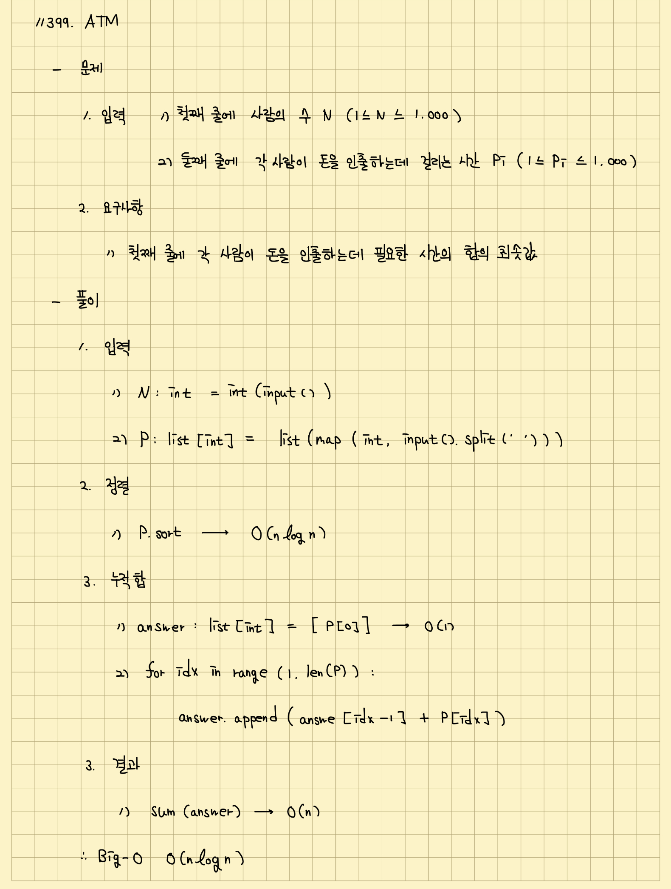

# 이것이 취업을 위한 코딩 테스트다

## 목차 :books:

- [진행 방법 :rocket:](#진행-방법-rocket)
  - [책과 강의](#책과-강의)
  - [외부 문제 풀이](#외부-문제-풀이)
    - [10분](#10분)
    - [30분](#30분)
    - [10분](#10분-1)
- [학습 내용 :memo:](#학습-내용-memo)
- [참여자 정보 :raised_hands:](#참여자-정보-raised_hands)

### 진행 방법 :rocket:

#### 책과 강의

[<이것이 취업을 위한 코딩 테스트다 with 파이썬>](http://www.kyobobook.co.kr/product/detailViewKor.laf?ejkGb=KOR&mallGb=KOR&barcode=9791162243077&orderClick=LEA&Kc=) 책을 기준으로 주차별 책 내용을 정리하고 책에 실려 있는 실제 문제를 풀어 이곳 깃헙 레포지토리에 공유합니다. 이때 책 이외의 다른 학습자료를 참고하길 희망할 경우 저자가 직접 촬영한 [유튜브 강의](https://www.youtube.com/watch?v=m-9pAwq1o3w&list=PLRx0vPvlEmdAghTr5mXQxGpHjWqSz0dgC)를 확인합니다.

#### 외부 문제 풀이

국내 알고리즘 문제풀이 서비스 [백준](https://www.acmicpc.net/)을 활용하여 주차별 관련 문제를 2-3문제씩 풉니다. 이때 문제 난이도는 [solved.ac](https://solved.ac/problems/level) 서비스에 나와있는 난이도를 기준으로 **실버II**부터 **골드III** 사이의 문제를 풉니다. 정해진 각 문제의 경우 주차별 [노션 세부 페이지](https://0417taehyun.notion.site/ALGO-GAGO-3bd1fda191c8434a937e97ed94fc9300)에서 확인 가능합니다.

문제를 풀 때 10분, 30분, 10분의 시간을 나눠 사용하여 문제를 풉니다.

##### 10분

문제의 접근법을 고민하는 시간입니다. 문제에서 요구하는 사항에 대해 정리하고 어떻게 접근해서 풀면 좋을지 노트에 정리합니다. 이때 가능하면 시간 복잡도도 함께 정리하여 코딩 인터뷰처럼 여러 풀이 중에서 해당 접근법을 선택해 문제를 풀려고 한 이유도 생각합니다.

예를 들어 백준 서비스에 올라온 [11399번: ATM](https://www.acmicpc.net/problem/11399) 문제에 대한 예시 노트 필기는 아래 이미지와 같습니다.



##### 30분

실제로 문제를 푸는 시간입니다. 이때 가능하면 테스트코드를 함께 작성합니다.

예를 들어 백준 서비스와 같이 입출력이 필요한 문제풀이의 경우 함수 형태로 본인의 정답을 모듈화하고 이를 모킹해서 아래 코드와 같이 테스트합니다.

```Python
# [ 백준 ] 11399번: ATM

def solution() -> None:
    N: int = int(input())
    P: list[int] = list(map(int, input().split(" ")))


    P.sort()
    answer: list[int] = [P[0]]

    for idx in range(1, len(P)):
        answer.append(answer[idx - 1] + P[idx])

    print(sum(answer))


if __name__ == "__main__":
    import io
    import unittest.mock


    def test_example_case() -> None:
        with unittest.mock.patch("builtins.input", side_effect=["5", "3 1 2 4 3"]):
            with unittest.mock.patch("sys.stdout", new_callable=io.StringIO) as test_stdout:
                solution()

        assert test_stdout.getvalue() == "32\n"


    test_example_case()
```

##### 10분

본인의 접근법에 따른 결과를 확인하고 통과하지 못한 케이스가 있으면 어디에서 문제가 발생한 것인지 파악합니다. 이후 본인의 풀이를 다른 스터디원과 공유합니다. 이때 문제를 끝내 풀지 못하더라도 본인의 접근법과 함께 타인의 풀이를 비교하여 해당 문제를 해결할 수 있는 방법을 정리해둡니다.

이렇게 문제풀이가 마무리되면 당일 학습한 내용을 정리하여 블로깅합니다. 예를 들어 [[ 알고리즘 ] 백준 11399번: ATM](https://velog.io/@dev_taehyun/algorithm-this-is-coding-test-for-employment-greedy) 글과 같습니다.

### 학습 내용 :memo:

<table>
<tr>
    <th> 스터디 내용 </th>
    <th> 진행 일자 </th>
    <th> 발표자 </th>
    <th> 참여자 </th>
</tr>
<tr align="left">
    <td> 1주차: 그리디  </td>
    <td> 2022. 06. 26. SUN. 19:00 - 22:00  </td>
    <td> 
        <a href="https://github.com/0417taehyun">이태현</a>
    </td>
    <td> 
        <a href="https://github.com/kanghw7730">강현우</a>,
        <a href="https://github.com/0417taehyun">이태현</a>,
        <a href="https://github.com/hgene0929">이현진</a>
    </td>    
</tr>
<tr align="left">
    <td> 2주차: 구현 </td>
    <td> 2022. 07. 03. SUN. 19:00 - 22:00  </td>
    <td> 
        <a href="https://github.com/hgene0929">이현진</a>  
    </td>
    <td>
        <a href="https://github.com/kanghw7730">강현우</a>,     
        <a href="https://github.com/0417taehyun">이태현</a>,
        <a href="https://github.com/hgene0929">이현진</a>        
    </td>    
</tr>
<tr align="left">
    <td> 3주차: DFS/BFS </td>
    <td> 2022. 07. 10. SUN. 19:00 - 22:00  </td>
    <td> 
    </td>
    <td> 
        <a href="https://github.com/0417taehyun">이태현</a>
    </td>    
</tr>
<tr align="left">
    <td> 4주차: 정렬 </td>
    <td> 2022. 07. 17. SUN. 19:00 - 22:00  </td>
    <td> 
    </td>
    <td> 
        <a href="https://github.com/0417taehyun">이태현</a>
    </td>    
</tr>
<tr align="left">
    <td> 5주차: 이진 탐색 </td>
    <td> 2022. 07. 24. SUN. 19:00 - 22:00  </td>
    <td> 
    </td>
    <td> 
        <a href="https://github.com/0417taehyun">이태현</a>
    </td>    
</tr>
<tr align="left">
    <td> 6주차: 다이나믹 프로그래밍 </td>
    <td> 2022. 07. 31. SUN. 19:00 - 22:00  </td>
    <td> 
    </td>
    <td> 
        <a href="https://github.com/0417taehyun">이태현</a>
    </td>    
</tr>
<tr align="left">
    <td> 7주차: 최단 경로 </td>
    <td> 2022. 08. 07. SUN. 19:00 - 22:00  </td>
    <td> 
    </td>
    <td> 
        <a href="https://github.com/0417taehyun">이태현</a>
    </td>    
</tr>
<tr align="left">
    <td> 8주차: 그래프 이론 </td>
    <td> 2022. 08. 14. SUN. 19:00 - 22:00  </td>
    <td> 
    </td>
    <td> 
        <a href="https://github.com/0417taehyun">이태현</a>
    </td>    
</tr>
<tr align="left">
    <td> 9주차: 2020년 상반기 삼성전자 기출문제 </td>
    <td> 2022. 08. 21. SUN. 19:00 - 22:00  </td>
    <td> 
    </td>
    <td> 
        <a href="https://github.com/0417taehyun">이태현</a>
    </td>    
</tr>
</table>

### 참여자 정보 :raised_hands:

아래 각 참여자의 이름을 클릭하여 개별 깃헙 프로필 페이지로 이동할 수 있습니다.

<table>
<tr>
    <td align="center"><a href="https://github.com/kanghw7730"><br /><sub><b>강현우</b></sub></a></td>
    <td align="center"><a href="https://github.com/0417taehyun"><br /><sub><b>이태현</b></sub></a></td>       
    <td align="center"><a href="https://github.com/hgene0929"><br /><sub><b>이현진</b></sub></a></td> 
</tr>
</table>
